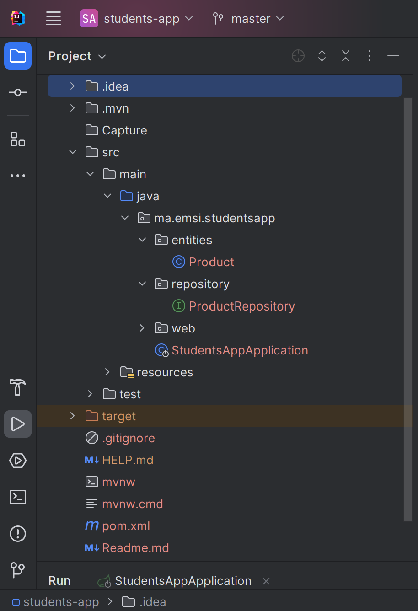
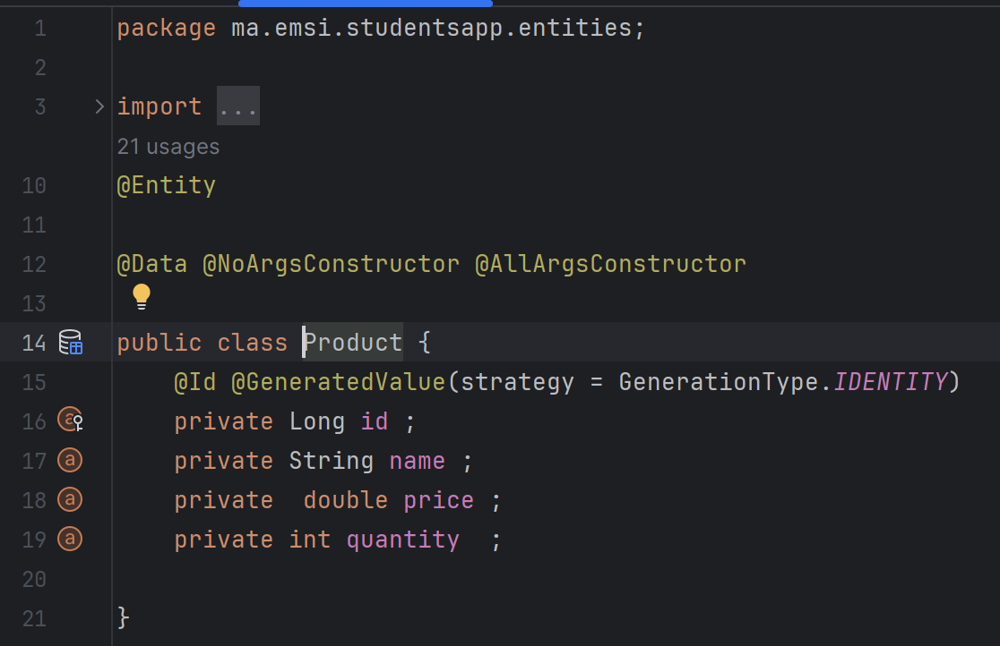
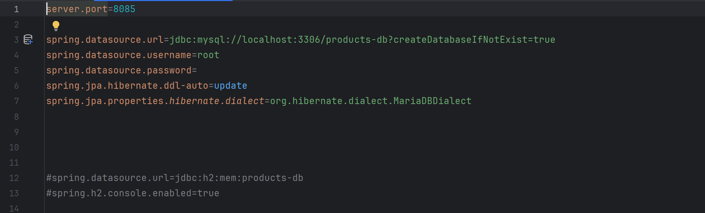
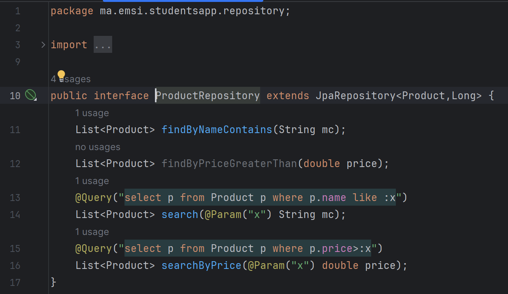

JPA
<h1>Compte rendu</h1>

1. Créer l'entité JPA Product ayant les attributs

4. Configurer l'unité de persistance dans le ficher application.properties 

5. Créer l'interface JPA Repository basée sur Spring data

6. Teste quelques opérations de gestion de patients :
